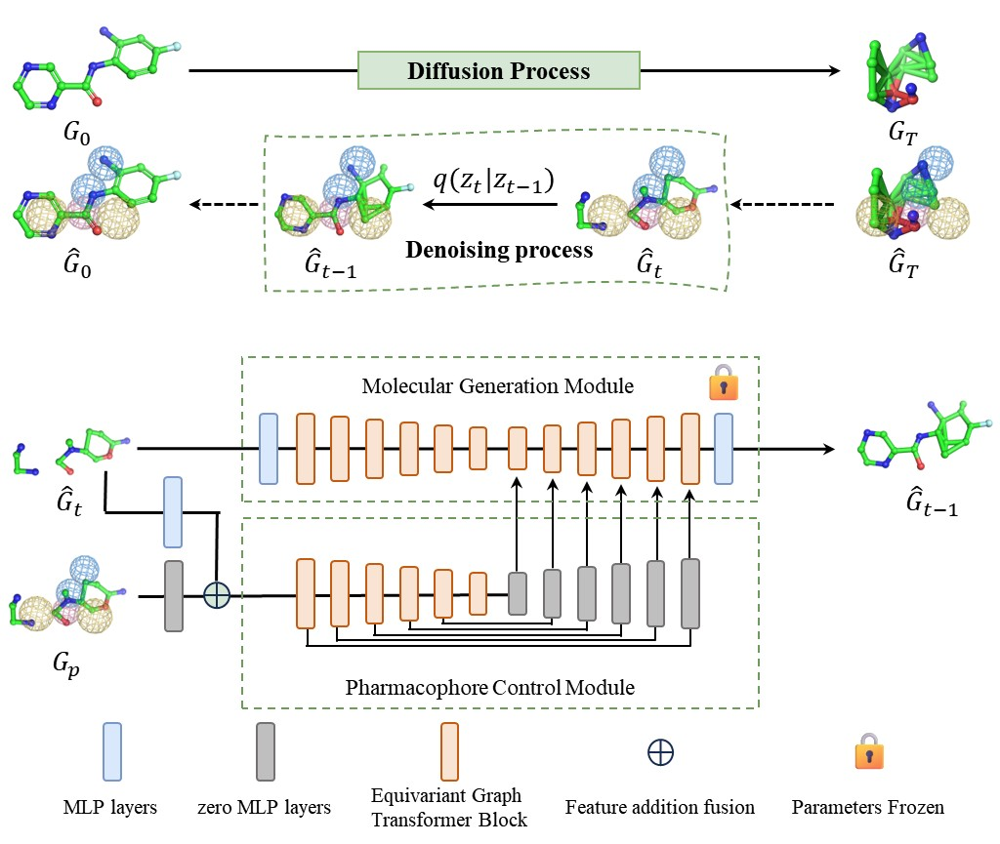
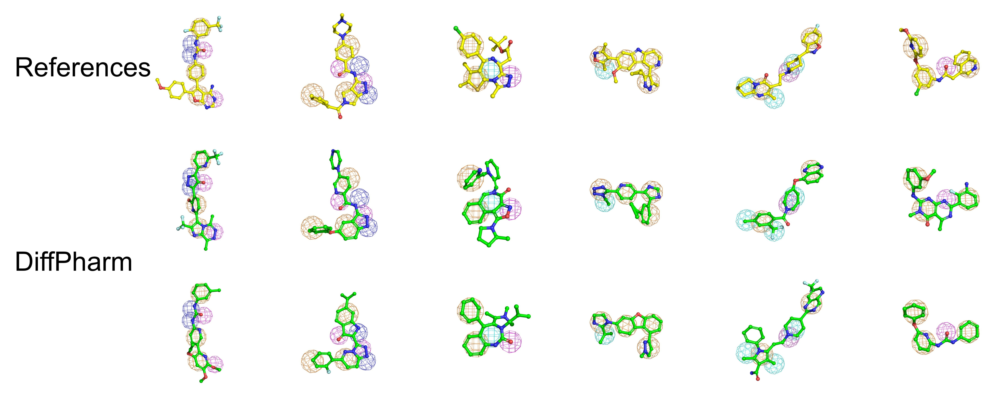
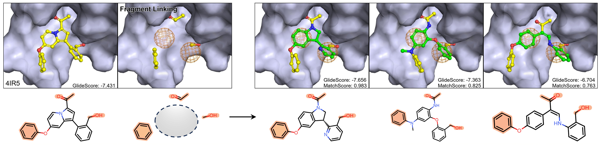

# [DiffPharm](https://chemrxiv.org/engage/chemrxiv/article-details/68d9f3723e708a7649ba89ba): Pharmacophore model guided 3D molecular generation through diffusion model


<p align="center">
  
</p>

## 📦 Conda Environment Dependencies

## Optimized Dependency List

- cudatoolkit == 11.8.0
- pytorch == 2.0.1
- rdkit == 2023.03.2
- scipy == 1.11.1
- hydra-core ==1.3.2
- imageio==2.31.1
- matplotlib==3.7.0
- numpy == 1.25.0
- omegaconf == 2.3.0
- pandas == 2.0.2
- Pillow==9.5.0
- pytorch_lightning == 2.0.6
- scikit_learn == 1.2.2
- setuptools==68.0.0
- torch_geometric == 2.3.1
- torchmetrics == 0.11.4
- tqdm == 4.65.0
- wandb == 0.15.4


You can create the environment with the following dependencies:

```bash
conda create -n diffpharm python=3.9 rdkit=2023.03.2
conda activate diffpharm


# Core dependencies
conda install -c "nvidia/label/cuda-11.8.0" cuda

pip3 install torch==2.0.1 --index-url https://download.pytorch.org/whl/cu118

pip install -r requirements.txt
```


## 📂 Datasets

We use the same datasets as the [MiDi](https://github.com/cvignac/MiDi) model.

Download and place them under `./data/geom/raw/`:

* **Train:** [Download](https://bits.csb.pitt.edu/files/geom_raw/train_data.pickle)
* **Validation:** [Download](https://bits.csb.pitt.edu/files/geom_raw/val_data.pickle)
* **Test:** [Download](https://bits.csb.pitt.edu/files/geom_raw/test_data.pickle)

You can also use other datasets you want to use, such as CHEMBL, ZINC, or others.

---

## 🏋️ Training

We use MiDi's checkpoint [geom-with-h-adaptive model](https://drive.google.com/file/d/1ExNpU7czGwhPWjpYCcz0mHGxLo8LvQ0b/view?usp=drive_link) as the pre-trained model. (We have also trained a new version of MiDi, [link is here](https://figshare.com/articles/dataset/All_parameters_required_for_DiffPharm_training_and_sampling_/30861413).)

Place it in:

```bash
./checkpoints/pre-trained/
```

Then run training, when we use the linker-free pharmacophore strategy. (removeHs=True)

```bash
cd ./midi
python main.py +experiment=linker_free_training
```

When we use the linker-align pharmacophore strategy. (removeHs=False)

```bash
cd ./midi
python main.py +experiment=linker_align_training
```
---

## 🧪 Testing

You can use:

* A model you trained in the previous step
* Or our trained model: [Download](https://figshare.com/articles/dataset/All_parameters_required_for_DiffPharm_training_and_sampling_/30861413)

Place it in:

```bash
./checkpoints/diffpharm/
```

Then run:

```bash
cd ./midi
python main.py +experiment=linker_free_training general.test_only='ABS_PATH'
or
python main.py +experiment=linker_align_training general.test_only='ABS_PATH'
```

Replace `ABS_PATH` with the absolute path of the model checkpoint.

---

## 🧬 Sampling Example

<p align="left">
  
</p>

### 1. Sampling via a Dedicated DiffPharm Script

This method is recommended for more lightweight or customized sampling scenarios. It directly invokes the dedicated sampling script `diffpharm_sampling.py.py`.

```bash
cd midi
python diffpharm_sampling.py +experiment=sampling
```

Make sure to set the correct `statistics_path` in your `sampling.yaml`. 

## 🌍 Inpainting (Sampling under Dual Control: Substructure Fixing + Pharmacophore Guidance)

<p align="center">
  
</p>

Inpainting allows you to design novel molecules around fixed substructures and pharmacophore-constraint, supporting tasks such as scaffold hopping, fragment linking, and fragment elaboration. You can either use your own trained model from the training step, or download our pre-trained model from the following link:

You can either use your **own trained model** from the training step, or download our **pre-trained model**:

📁 [Pretrained Model on Google Drive](https://figshare.com/articles/dataset/All_parameters_required_for_DiffPharm_training_and_sampling_/30861413)

> After downloading, place the model files into the `./checkpoints/diffpharm/` directory.

---

### ⚛️ How It Works

The inpainting workflow could refer to `/inpainting_use/README.md`